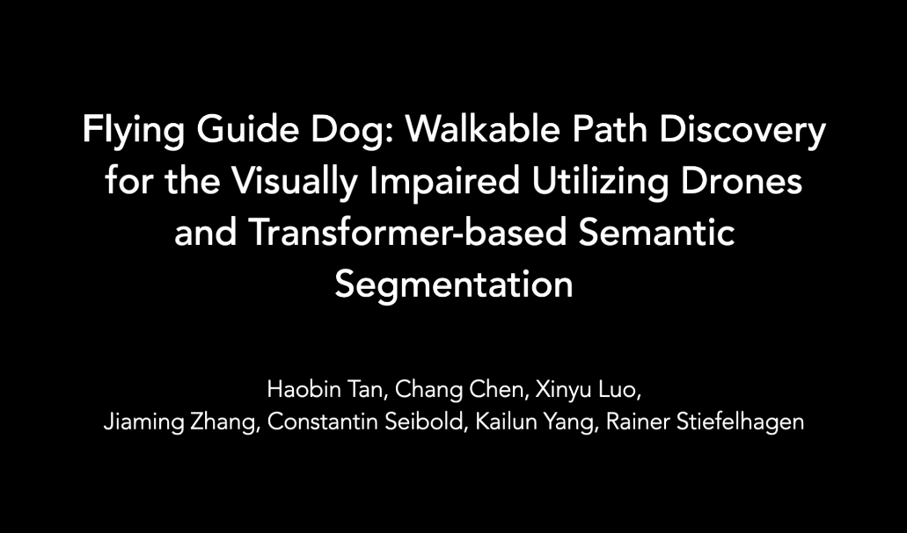

## Updates

- [2021.09.17] Code for flying guide dog prototype and the Pedestrian and Vehicle Traffic Lights (PVTL) dataset are released.

# Flying Guide Dog

Official implementation of paper "**[Flying Guide Dog: Walkable Path Discovery for the Visually Impaired Utilizing Drones and Transformer-based Semantic Segmentation](https://arxiv.org/abs/2108.07007)**".


## Overview

- `config/`: Config
  - `experiment/`: Config yaml files for different experiments
  - `default.py`: Default config
- `drone/`: Drone initialization and control
- `models/`: Deep Learning models
  - `segmentation/`: Segmentation models
  - `traffic_light_classification/`: Traffic light classification models
- `utils/`: Helper functions and scripts


## Drone

The drone used in this project is **DJI Tello**.


## Requirements

Python 3.7 or later with all [requirements.txt](./requirements.txt) dependencies installed, including `torch>=1.7`. 

To install run:

```bash
pip install -r requirements.txt
```

### SegFormer

1. Install `mmcv-full`

   To use [SegFormer](https://github.com/NVlabs/SegFormer), you need to install `mmcv-full==1.2.7`. For example, to install `mmcv-full==1.2.7` with `CUDA 11` and `PyTorch 1.7.0`, use the following command:

   ```bash
   pip install mmcv-full==1.2.7 -f https://download.openmmlab.com/mmcv/dist/cu110/torch1.7.0/index.html
   ```

   To install `mmcv-full` with different version of PyTorch and CUDA, please see: [MMCV Installation](https://mmcv.readthedocs.io/en/latest/get_started/installation.html).

2. Use submodule `SegFormer` 

   - Initialize the submodule(s):

     ```bash
     git submodule init
     ```

   - Run the update to pull down the files:

     ```bash
     git submodule update
     ```

3. Install the dependencies of `SegFormer`:

   ```bash
   pip install -e models/segmentation/SegFormer/ --user
   ```

4. Copy config file to `SegFormer/`

   ```bash
   cp models/segmentation/segformer.b0.768x768.mapillary.160k.py models/segmentation/SegFormer/local_configs/segformer/B0
   ```


## Models

Two types of models are used: **street view semantic segmentation** and **traffic lights classification**.

### Street view semantic segmentation

We adopt SegFormer-B0 (trained on [Mapillary Vistas](https://www.mapillary.com/dataset/vistas) for 160K iterations) for street-view semantic segmentation based on each frame captured by the drone.

### Traffic lights classification

We create a custom traffic lights dataset named **Pedestrian and Vehicle Traffic Lights (PVTL) Dataset** using traffic lights images cropped from  [Cityscapes](https://www.cityscapes-dataset.com/), [Mapillary Vistas](https://www.mapillary.com/dataset/vistas), and [PedestrianLights](https://www.uni-muenster.de/PRIA/en/forschung/index.shtml). The PVTL dataset can be downloaded from [Google Drive](https://drive.google.com/drive/folders/1UFcr-b4Ci5BsA72TZWJ77n-J3aneli6l?usp=sharing).

It containes 5 classes: Others, Pedestrian-red, Pedestrian-green, Vehicle-red, and Vehicle-green. Each class contains about 300 images. Train-validation split is 3:1.


We train 2 models on this dataset:

- **ResNet-18**: We fine-tune ResNet-18 from `torchvision.models`. After 25 epochs training, the accuracy achieves around 90%.
- **Simple CNN model**: We build our custom simple CNN model (5 CONV + 3 FC). After 25 epochs training, the accuracy achieves around 83%.

### Trained weights

1. Create `weights` folder and its subfolder `segmentation` and `traffic_light_classification`

   ```bash
   mkdir -p weights/segmentation weights/traffic_light_classification
   ```

2. Download trained weights from [Google Drive](https://drive.google.com/drive/folders/1efvfGxh2f1nCppO9YaPn6SyUQjG--QkC?usp=sharing) and put them into corresponding folders

    

## Usage

1. Choose a config file in `config/experiment/`, *e.g.* `config/experiment/segformer-b0_720x480_fp32.yaml`. You can also create your custom config file by adjusting the default config.

2. Run

   ```bash
   python main.py --cfg <config_file>
   ```

   Model specified in the config file will be loaded.

   For example:

   ```bash
   python main.py --cfg config/experiment/segformer-b0_720x480_fp32.yaml
   ```

3. **Turn on DJI Tello. Connect to drone's wifi.** 

4. Run

   ```bash
   python main.py --cfg <config_file> --ready
   ```

   For example:

   ```bash
   python main.py --cfg config/experiment/segformer-b0_720x480_fp32.yaml --ready
   ```

   After initialization for a few seconds, an OpenCV window will pop up. Then press `T` to take off. During flying, the drone will keep discovering walkable areas and try to keep itself in the middle as well as follow along the walkable path. When pedestrian traffic light occurs in drone's FOV, it will react based on the classification prediction of pedestrian traffic light signal.

   Another keyboard controls:

   - `L`: Land temporarily. You can press `T` to take off again.
   - `Q`: Land and exit.
   - `Esc`: Emergency stop. All motors will stop immediately.

## Demo Video

[](https://youtu.be/lBYnu3mm6pY "Video on Youtube")

## Citation

```
@article{tan2021flying,
  title={Flying Guide Dog: Walkable Path Discovery for the Visually Impaired Utilizing Drones and Transformer-based Semantic Segmentation},
  author={Tan, Haobin and Chen, Chang and Luo, Xinyu and Zhang, Jiaming and Seibold, Constantin and Yang, Kailun and Stiefelhagen, Rainer},
  journal={arXiv preprint arXiv:2108.07007},
  year={2021}
}
```

## Acknowledgements

Great thanks for these open-source repositories: 

- DJI Tello drone python interface: [DJITelloPy](https://github.com/damiafuentes/DJITelloPy)

- Semantic segmentation: [fastseg](https://github.com/ekzhang/fastseg), [DS-PASS](https://github.com/elnino9ykl/DS-PASS), [SegFormer](https://github.com/NVlabs/SegFormer)
